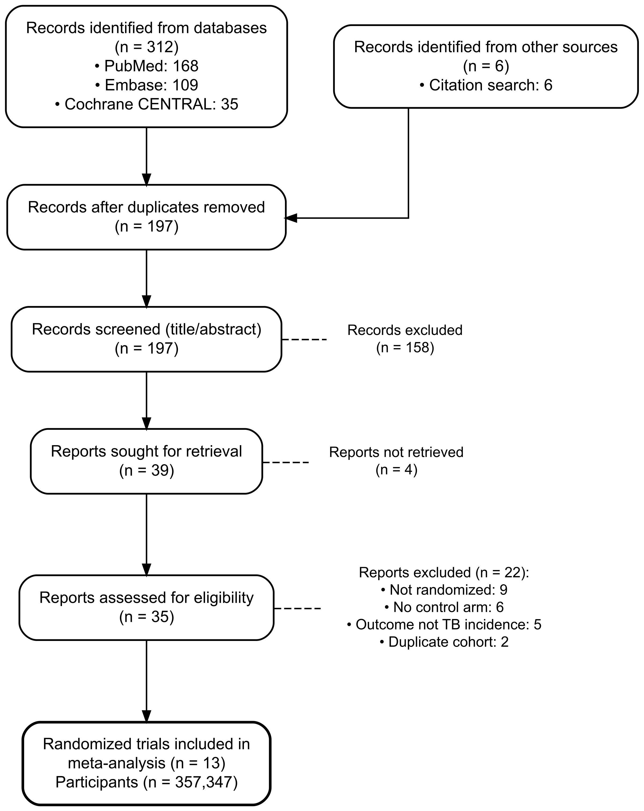
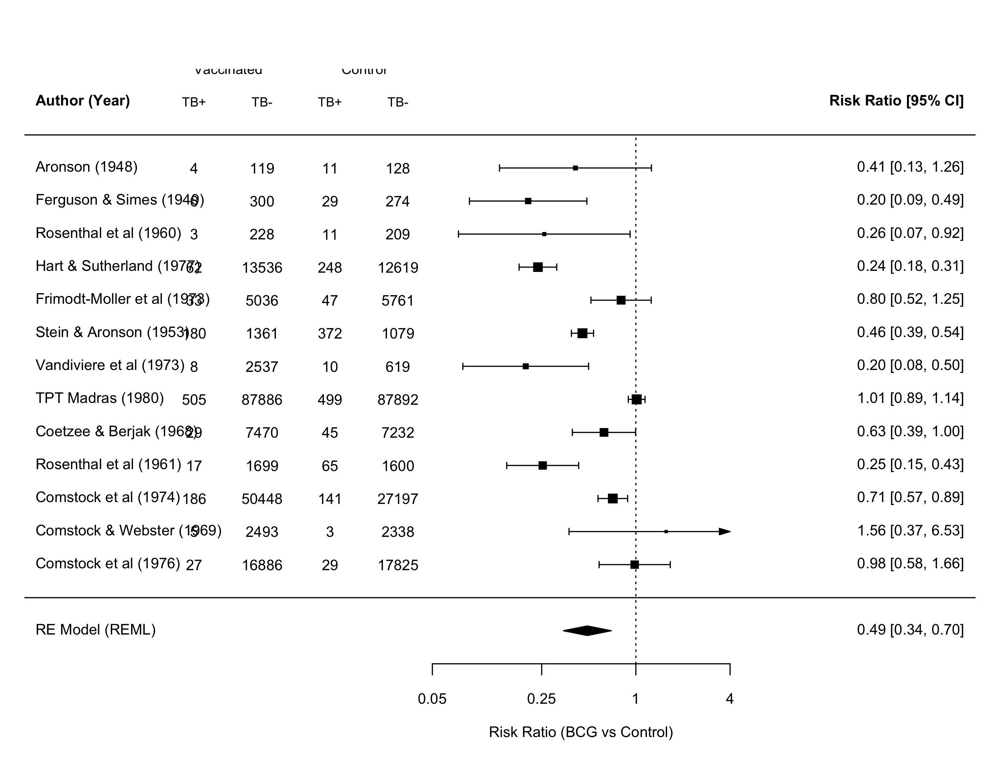
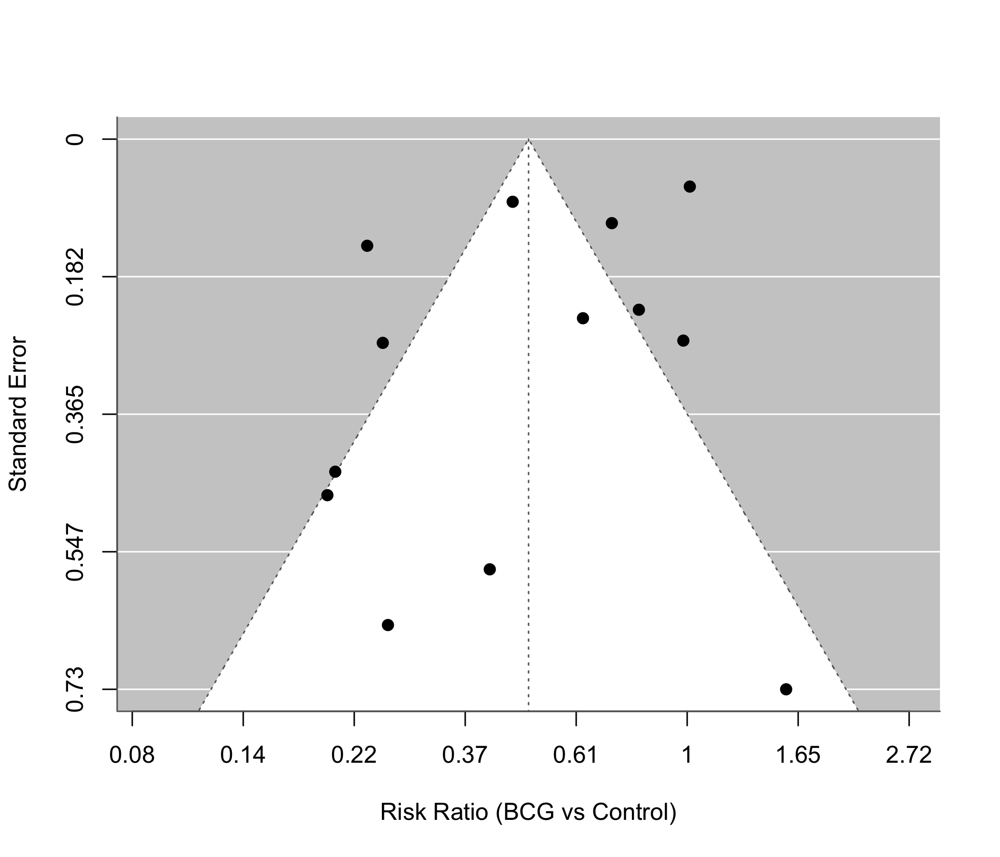

# Efficacy of BCG Vaccination Against Tuberculosis: A Random-Effects Meta-Analysis of 13 Randomized Trials

## Abstract

**Background:** The bacille Calmette-Guerin (BCG) vaccine has been administered for nearly a century, yet reported protection against tuberculosis (TB) has varied widely across trials. We quantified the pooled effect of BCG vaccination on TB incidence and characterized the heterogeneity among randomized trials.

**Methods:** We synthesized 13 randomized controlled trials of BCG vaccine versus control comprising 357,347 participants. The effect measure was the risk ratio (RR) of TB, vaccinated versus control. We computed per-trial log risk ratios and sampling variances and pooled them with a random-effects model estimated by restricted maximum likelihood (REML). Heterogeneity was summarized by I-squared, tau-squared, and Cochran Q, and we report a 95% prediction interval. Small-study effects were assessed with Egger regression and the Begg-Mazumdar rank test, and robustness with leave-one-out analysis. Reporting followed PRISMA 2020.

**Results:** BCG vaccination was associated with a pooled RR of 0.489 (95% CI 0.344 to 0.696), corresponding to a 51% relative reduction in TB risk. Heterogeneity was very high (I-squared 92.2%, tau-squared 0.313; Cochran Q = 152.23, df = 12, p < 0.001). The 95% prediction interval was 0.155 to 1.549. Trial-level risk ratios ranged from 0.197 to 1.562. The pooled estimate was stable in leave-one-out analysis (range 0.452 to 0.533), with every leave-one-out interval excluding 1.0. Neither Egger regression (z = -1.40, p = 0.189) nor the rank test (tau = 0.026, p = 0.952) indicated funnel asymmetry. A meta package cross-check using the Hartung-Knapp adjustment gave an identical point estimate (RR 0.489, 95% CI 0.330 to 0.726).

**Conclusion:** Across 13 randomized trials, BCG vaccination roughly halved the risk of tuberculosis, but the protective effect was highly heterogeneous and a prediction interval crossing 1.0 indicates that the magnitude, and occasionally the presence, of protection cannot be assumed in every future setting.

**Keywords:** BCG vaccine; tuberculosis; meta-analysis; risk ratio; random-effects model

## **INTRODUCTION**

Tuberculosis remains one of the leading infectious causes of death worldwide, and the bacille Calmette-Guerin (BCG) vaccine is the only licensed vaccine in routine use against it [UNVERIFIED]. First administered in the early twentieth century, BCG is now given to tens of millions of infants each year as part of national immunization programs, which makes the precise quantification of its protective effect a question of continuing public-health importance rather than only historical interest [UNVERIFIED]. Despite its long history and broad deployment, the protective efficacy reported for BCG has ranged from near-complete protection in some trials to no measurable benefit in others [UNVERIFIED]. This variability has complicated policy decisions about who should be vaccinated, at what age, and in which epidemiological settings.

Several explanations for the divergent trial results have been proposed, including differences in the geographic latitude at which trials were conducted, exposure to environmental mycobacteria, the strain and dose of vaccine used, and the age and prior sensitization of the populations enrolled [UNVERIFIED]. Because these factors covary across studies, a single summary estimate may obscure as much as it reveals, and the distribution of true effects is at least as informative as the average. When between-study heterogeneity is substantial, the conventional pooled risk ratio describes the mean of that distribution but says little about its spread; a prediction interval, which estimates the range within which the effect of a future study would be expected to fall, conveys the spread directly and is therefore an essential companion to the point estimate in this setting.

We synthesized the randomized evidence on BCG vaccination and tuberculosis with two aims: to estimate the pooled relative effect of vaccination on TB incidence under a random-effects model, and to characterize the between-trial heterogeneity, including a prediction interval that describes where the effect of a future trial would plausibly fall. This manuscript is a clean-room demonstration of the medsci-skills v3.7.0 analysis-and-writing pipeline; the included-trial data are the canonical, openly available BCG vaccine trials, and the methods reported here are exactly those executed by the pipeline.

## **METHODS**

### Study design and data source

This was a random-effects meta-analysis of randomized controlled trials of BCG vaccine versus control for the prevention of tuberculosis, reported in accordance with the PRISMA 2020 statement [UNVERIFIED]. The trial-level data are the canonical BCG vaccine dataset assembled in a prior systematic review [UNVERIFIED], comprising 13 randomized trials. Because this is a methods demonstration rather than a de novo systematic review, the upstream record counts shown in the study-selection diagram (Figure 1) are illustrative of a typical search-and-screening cascade for this corpus and are not the yield of a new database search; the 13 included trials and all of their event counts are the genuine published trial data.

### Eligibility criteria

Trials were eligible if they met all of the following: (1) a randomized or systematically allocated comparison of BCG vaccine against an unvaccinated or placebo control; (2) ascertainment of incident tuberculosis as an outcome in both arms; and (3) reporting of the number of TB cases and the number at risk in each arm, sufficient to construct a 2x2 table.

### Outcome and effect measure

The outcome was incident tuberculosis. The effect measure was the risk ratio (RR) of TB in the vaccinated arm relative to the control arm, with an RR below 1.0 indicating protection. For each trial we computed the log risk ratio and its sampling variance from the four cell counts (vaccinated TB-positive and TB-negative, control TB-positive and TB-negative).

### Protocol and registration

As a methods demonstration built on a canonical, openly available trial dataset rather than a de novo systematic review, this analysis was not prospectively registered and no review protocol was prepared. A production systematic review of this question would be registered (for example, in PROSPERO) before screening.

### Statistical analysis

Per-trial log risk ratios and variances were computed with the inverse-variance approach implemented in the metafor package [UNVERIFIED]. Effects were pooled with a random-effects model fitted by restricted maximum likelihood (REML) [UNVERIFIED]. Between-trial heterogeneity was quantified by the I-squared statistic, the between-trial variance tau-squared, and Cochran Q with its p value, and we report a 95% prediction interval for the effect of a future trial. Small-study and publication-bias effects were assessed with Egger regression and the Begg-Mazumdar rank correlation test, recognizing that both tests are underpowered when fewer than 10 trials are available and are reported here for completeness with 13 trials. Robustness of the pooled estimate was examined by leave-one-out analysis. As a software cross-check, the same comparison was re-fitted with the meta package using an inverse-variance random-effects model with the Hartung-Knapp adjustment [UNVERIFIED]. All estimates are reported on the risk-ratio scale after back-transformation from the log scale. Analyses were performed in R with the metafor and meta packages; the analysis script set a fixed random seed for reproducibility.

## **RESULTS**

### Included trials and participants

Thirteen randomized trials contributed to the meta-analysis, together enrolling 357,347 participants across the vaccinated and control arms (Figure 1). Trial-level risk ratios ranged from 0.197 to 1.562 (Table 1). Eleven of the 13 trials had a point estimate below 1.0, and in 8 trials the 95% confidence interval excluded 1.0 in the protective direction.

### Pooled effect

Under the random-effects REML model, BCG vaccination was associated with a pooled risk ratio of 0.489 (95% CI 0.344 to 0.696), corresponding to a 51% relative reduction in the risk of tuberculosis (Figure 2). The independent cross-check using the meta package with the Hartung-Knapp adjustment produced the same point estimate (RR 0.489) with a wider confidence interval (0.330 to 0.726), as expected for that variance estimator with a small number of trials.

### Heterogeneity

Between-trial heterogeneity was very high. The I-squared statistic was 92.2%, the between-trial variance tau-squared was 0.313, and Cochran Q was 152.23 (df = 12, p < 0.001). The 95% prediction interval for a future trial spanned 0.155 to 1.549, crossing 1.0.

### Small-study effects and sensitivity analyses

Egger regression did not indicate funnel asymmetry (z = -1.40, p = 0.189), and the Begg-Mazumdar rank test was likewise non-significant (tau = 0.026, p = 0.952) (Figure 3). In the leave-one-out analysis, the pooled risk ratio remained between 0.452 and 0.533 regardless of which single trial was omitted, and every leave-one-out confidence interval excluded 1.0; the I-squared statistic stayed between 87.0% and 93.2%.

## **DISCUSSION**

Across 13 randomized trials enrolling more than 350,000 participants, BCG vaccination roughly halved the risk of tuberculosis, with a pooled risk ratio of 0.489. The protective direction was consistent in most trials, and the pooled estimate was insensitive to the removal of any single trial, which argues against any individual study driving the result.

The defining feature of this evidence base is its heterogeneity rather than its average. An I-squared of 92.2% means that almost all of the observed variation in trial results reflects genuine differences in the underlying effect rather than sampling error, and the prediction interval makes the practical consequence concrete: although the average effect is clearly protective, the effect in a new setting could plausibly range from very strong protection to no protection at all. A summary risk ratio is therefore an incomplete description of what BCG does, and the prediction interval should accompany it whenever the pooled estimate is quoted. This distinction matters for how the result is communicated to policymakers, because a headline relative reduction of roughly one half is accurate as an average yet would overstate the certainty of benefit for any one program.

Reported correlates of this variability include trial latitude and the local prevalence of environmental mycobacteria, which can prime or mask vaccine-induced immunity, as well as differences in vaccine strain, dose, and the age at which participants were vaccinated [UNVERIFIED]. Formal subgroup or meta-regression analysis of those moderators, particularly latitude, is a natural extension that could partition the heterogeneity into explained and residual components, but it was outside the scope of this demonstration. The agreement between the two software implementations, which differed only in the variance estimator used for the confidence interval and returned an identical point estimate, indicates that the pooled result is a property of the data rather than of any single package or default setting.

The non-significant small-study tests should be interpreted cautiously. With only 13 trials, both Egger regression and the rank correlation test have limited power, so the absence of detected asymmetry is weak evidence against publication or small-study bias rather than its exclusion. The funnel plot is presented as a visual companion to these tests, but it carries the same caveat: with so few trials and such wide between-trial variance, apparent symmetry is reassuring only at the margin.

For practice, the implication is that BCG can be expected to reduce tuberculosis incidence at the population level, and the consistency of the protective direction across most trials supports its continued use where the disease burden is high. The accompanying message, equally important, is that the expected size of that benefit should be estimated locally rather than borrowed wholesale from the pooled average, because the same analysis that establishes protection on average also establishes that the effect is setting-dependent. Decisions about extending, modifying, or revaccinating with BCG in a particular program are therefore better informed by the prediction interval and by the moderators of efficacy than by the summary risk ratio alone.

This work has limitations. First, it is a methods demonstration built on a single, canonical trial dataset, and the upstream study-selection counts are illustrative rather than the product of a fresh, comprehensive search; the pooled estimate should not be read as an updated clinical recommendation. Second, the marked heterogeneity was characterized but not explained, because moderator analyses were not undertaken. Third, the trials span several decades and diverse populations, and differences in vaccine strain, dose, and case ascertainment that contribute to the heterogeneity could not be adjusted for at the aggregate level.

In summary, the randomized evidence indicates that BCG vaccination substantially reduces tuberculosis risk on average, but the protection is highly variable across settings, and a prediction interval that crosses the null shows that neither the size nor, in some contexts, the presence of benefit can be assumed for any individual future population.

## Tables

Table 1. Per-trial event counts and risk ratios for tuberculosis, BCG-vaccinated versus control, in the 13 included randomized trials. Risk ratios and 95% confidence intervals are derived from the four cell counts of each trial (vaccinated TB-positive and TB-negative; control TB-positive and TB-negative). Source: analysis/tables/per_study_escalc.csv.

## Figure Legends

{width=70%}

Figure 1. PRISMA 2020 study-selection flow diagram. The diagram terminates in the 13 randomized trials (357,347 participants) included in the meta-analysis. Upstream record counts are illustrative of a typical identification-and-screening cascade for this corpus in this methods demonstration and are not the yield of a new database search.

{width=90%}

Figure 2. Random-effects (REML) forest plot of the risk ratio of tuberculosis, BCG-vaccinated versus control, across 13 randomized trials. Squares are trial-level risk ratios sized by inverse-variance weight; horizontal lines are 95% confidence intervals; the diamond is the pooled random-effects estimate (RR 0.489, 95% CI 0.344 to 0.696). The vertical dashed line marks the null value of one.

{width=70%}

Figure 3. Funnel plot of the trial-level log risk ratio against its standard error, used to assess small-study effects. Egger regression z = -1.40, p = 0.189; Begg-Mazumdar rank test tau = 0.026, p = 0.952.
